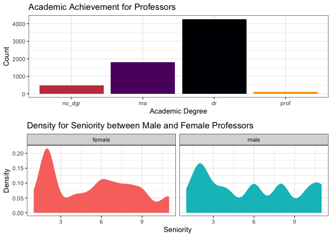

Quinn Lynas

In this lab, we will be using the `dplyr` package to explore student
evaluations of teaching data.

**You are expected to use functions from `dplyr` to do your data
manipulation!**

# Part 1: GitHub Workflow

Now that you have the Lab 5 repository cloned, you need to make sure you
can successfully push to GitHub. To do this you need to:

- Open the `lab-5-student.qmd` file (in the lower right hand corner).
- Change the `author` line at the top of the document (in the YAML) to
  your name.
- Save your file either by clicking on the blue floppy disk or with a
  shortcut (command / control + s).
- Click the “Git” tab in upper right pane
- Check the “Staged” box for the `lab-5-student.qmd` file (the file you
  changed)
- Click “Commit”
- In the box that opens, type a message in “Commit message”, such as
  “Added my name”.
- Click “Commit”.
- Click the green “Push” button to send your local changes to GitHub.

RStudio will display something like:

    >>> /usr/bin/git push origin HEAD:refs/heads/main
    To https://github.com/atheobold/introduction-to-quarto-allison-theobold.git
       3a2171f..6d58539  HEAD -> main

Now you are ready to go! Remember, as you are going through the lab I
would strongly recommend rendering your HTML and committing your after
**every** question!

# Part 2: Some Words of Advice

Part of learning to program is learning from a variety of resources.
Thus, I expect you will use resources that you find on the internet.
There is, however, an important balance between copying someone else’s
code and *using their code to learn*.

Therefore, if you use external resources, I want to know about it.

- If you used Google, you are expected to “inform” me of any resources
  you used by **pasting the link to the resource in a code comment next
  to where you used that resource**.

- If you used ChatGPT, you are expected to “inform” me of the assistance
  you received by (1) indicating somewhere in the problem that you used
  ChatGPT (e.g., below the question prompt or as a code comment),
  and (2) downloading and including the `.txt` file containing your
  **entire** conversation with ChatGPT.

Additionally, you are permitted and encouraged to work with your peers
as you complete lab assignments, but **you are expected to do your own
work**. Copying from each other is cheating, and letting people copy
from you is also cheating. Please don’t do either of those things.

## Setting Up Your Code Chunks

- The first chunk of this Quarto document should be used to *declare
  your libraries* (probably only `tidyverse` for now).
- The second chunk of your Quarto document should be to *load in your
  data*.

## Save Regularly, Render Often

- Be sure to **save** your work regularly.
- Be sure to **render** your file every so often, to check for errors
  and make sure it looks nice.
  - Make sure your Quarto document does not contain `View(dataset)` or
    `install.packages("package")`, both of these will prevent rendering.
  - Check your Quarto document for occasions when you looked at the data
    by typing the name of the data frame. Leaving these in means the
    whole dataset will print out and this looks unprofessional. **Remove
    these!**
  - If all else fails, you can set your execution options to
    `error: true`, which will allow the file to render even if errors
    are present.

# Part 3: Let’s Start Working with the Data!

## The Data

The `teacher_evals` dataset contains student evaluations of reaching
(SET) collected from students at a University in Poland. There are SET
surveys from students in all fields and all levels of study offered by
the university.

The SET questionnaire that every student at this university completes is
as follows:

> Evaluation survey of the teaching staff of University of Poland.
> Please complete the following evaluation form, which aims to assess
> the lecturer’s performance. Only one answer should be indicated for
> each question. The answers are coded in the following way: 5 - I
> strongly agree; 4 - I agree; 3 - Neutral; 2 - I don’t agree; 1 - I
> strongly don’t agree.
>
> Question 1: I learned a lot during the course.
>
> Question 2: I think that the knowledge acquired during the course is
> very useful.
>
> Question 3: The professor used activities to make the class more
> engaging.
>
> Question 4: If it was possible, I would enroll for a course conducted
> by this lecturer again.
>
> Question 5: The classes started on time.
>
> Question 6: The lecturer always used time efficiently.
>
> Question 7: The lecturer delivered the class content in an
> understandable and efficient way.
>
> Question 8: The lecturer was available when we had doubts.
>
> Question 9. The lecturer treated all students equally regardless of
> their race, background and ethnicity.

These data are from the end of the winter semester of the 2020-2021
academic year. In the period of data collection, all university classes
were entirely online amid the COVID-19 pandemic. While expected learning
outcomes were not changed, the online mode of study could have affected
grading policies and could have implications for data.

**Average SET scores** were combined with many other variables,
including:

1.  **characteristics of the teacher** (degree, seniority, gender, SET
    scores in the past 6 semesters).
2.  **characteristics of the course** (time of day, day of the week,
    course type, course breadth, class duration, class size).
3.  **percentage of students providing SET feedback.**
4.  **course grades** (mean, standard deviation, percentage failed for
    the current course and previous 6 semesters).

This rich dataset allows us to **investigate many of the biases in
student evaluations of teaching** that have been reported in the
literature and to formulate new hypotheses.

Before tackling the problems below, study the description of each
variable included in the `teacher_evals_codebook.pdf`.

**1. Load the appropriate R packages for your analysis.**

``` r
# code chunk for loading packages
library(tidyverse)
```

    ── Attaching core tidyverse packages ──────────────────────── tidyverse 2.0.0 ──
    ✔ dplyr     1.1.4     ✔ readr     2.1.5
    ✔ forcats   1.0.0     ✔ stringr   1.5.1
    ✔ ggplot2   3.5.1     ✔ tibble    3.2.1
    ✔ lubridate 1.9.4     ✔ tidyr     1.3.1
    ✔ purrr     1.0.2     
    ── Conflicts ────────────────────────────────────────── tidyverse_conflicts() ──
    ✖ dplyr::filter() masks stats::filter()
    ✖ dplyr::lag()    masks stats::lag()
    ℹ Use the conflicted package (<http://conflicted.r-lib.org/>) to force all conflicts to become errors

**2. Load in the `teacher_evals` data.**

``` r
# code chunk for importing the data
teacher_evals <- read_csv("data-raw/teacher_evals.csv")
```

    Rows: 8015 Columns: 22
    ── Column specification ────────────────────────────────────────────────────────
    Delimiter: ","
    chr  (5): course_id, weekday, time_of_day, academic_degree, gender
    dbl (17): teacher_id, question_no, no_participants, resp_share, SET_score_av...

    ℹ Use `spec()` to retrieve the full column specification for this data.
    ℹ Specify the column types or set `show_col_types = FALSE` to quiet this message.

### Data Inspection + Summary

**3. Provide a brief overview (~4 sentences) of the dataset.**

``` r
# you may want to use code to answer this question
head(teacher_evals, 8)
```

    # A tibble: 8 × 22
      course_id  teacher_id question_no no_participants resp_share SET_score_avg
      <chr>           <dbl>       <dbl>           <dbl>      <dbl>         <dbl>
    1 0000-BHP        54655         901             255     0.212           4.22
    2 0000-BHP        54655         903             255     0.208           3.68
    3 0000-BHP        54655         904             255     0.212           3.74
    4 0000-BHP        54655         905             255     0.208           3.30
    5 0000-BHP        54655         907             255     0.208           3.68
    6 0000-BW-NP       3432         902             998     0.0411          4.05
    7 0000-BW-NP       3432         903             998     0.0421          3.95
    8 0000-BW-NP       3432         906             998     0.0411          4.15
    # ℹ 16 more variables: stud_grade_avg <dbl>, stud_grade_std <dbl>,
    #   stud_grade_var_coef <dbl>, percent_failed <dbl>, stud_grade_avg_cur <dbl>,
    #   stud_grade_std_cur <dbl>, stud_grade_var_coef_cur <dbl>,
    #   percent_failed_cur <dbl>, class_duration <dbl>, weekday <chr>,
    #   time_of_day <chr>, SET_score_1sem <dbl>, maximum_score <dbl>,
    #   academic_degree <chr>, seniority <dbl>, gender <chr>

> The dataset includes information about individual teachers and
> courses. There are 22 columns of information and 8015 rows.

**4. What is the unit of observation (i.e. a single row in the dataset)
identified by?**

``` r
# you may want to use code to answer this question
head(teacher_evals, 6)
```

    # A tibble: 6 × 22
      course_id  teacher_id question_no no_participants resp_share SET_score_avg
      <chr>           <dbl>       <dbl>           <dbl>      <dbl>         <dbl>
    1 0000-BHP        54655         901             255     0.212           4.22
    2 0000-BHP        54655         903             255     0.208           3.68
    3 0000-BHP        54655         904             255     0.212           3.74
    4 0000-BHP        54655         905             255     0.208           3.30
    5 0000-BHP        54655         907             255     0.208           3.68
    6 0000-BW-NP       3432         902             998     0.0411          4.05
    # ℹ 16 more variables: stud_grade_avg <dbl>, stud_grade_std <dbl>,
    #   stud_grade_var_coef <dbl>, percent_failed <dbl>, stud_grade_avg_cur <dbl>,
    #   stud_grade_std_cur <dbl>, stud_grade_var_coef_cur <dbl>,
    #   percent_failed_cur <dbl>, class_duration <dbl>, weekday <chr>,
    #   time_of_day <chr>, SET_score_1sem <dbl>, maximum_score <dbl>,
    #   academic_degree <chr>, seniority <dbl>, gender <chr>

> It appears that one row in the dataset measures answers for a single
> question for a particular course.

**5. Use *one* `dplyr` pipeline to clean the data by:**

- **renaming the `gender` variable `sex`**
- **removing all courses with fewer than 10 respondents**
- **changing data types in whichever way you see fit (e.g., is the
  instructor ID really a numeric data type?)**
- **only keeping the columns we will use – `course_id`, `teacher_id`,
  `question_no`, `no_participants`, `resp_share`, `SET_score_avg`,
  `percent_failed_cur`, `academic_degree`, `seniority`, and `sex`**

**Assign your cleaned data to a new variable named `teacher_evals_clean`
–- use these data going forward. Save the data as
`teacher_evals_clean.csv` in the `data-clean` folder.**

``` r
# code chunk for Q4
teacher_evals_clean <- teacher_evals |>
  rename(sex = gender) |>
  filter(no_participants > 10) |>
  mutate(teacher_id = as.character(teacher_id), 
         question_no = as.character(question_no)) |>
  select(course_id, teacher_id, question_no, no_participants, resp_share, SET_score_avg, percent_failed_cur, academic_degree, seniority, sex)

write.csv(teacher_evals_clean, "data-clean/teacher_evals_clean.csv")
```

**6. How many unique instructors and unique courses are present in the
cleaned dataset?**

``` r
# code chunk for Q5
dim(teacher_evals_clean |>
  select(teacher_id) |>
  summarise(unique(teacher_id)))
```

    Warning: Returning more (or less) than 1 row per `summarise()` group was deprecated in
    dplyr 1.1.0.
    ℹ Please use `reframe()` instead.
    ℹ When switching from `summarise()` to `reframe()`, remember that `reframe()`
      always returns an ungrouped data frame and adjust accordingly.

    [1] 294   1

``` r
dim(teacher_evals_clean |>
  select(course_id) |>
  summarise(unique(course_id)))
```

    Warning: Returning more (or less) than 1 row per `summarise()` group was deprecated in
    dplyr 1.1.0.
    ℹ Please use `reframe()` instead.
    ℹ When switching from `summarise()` to `reframe()`, remember that `reframe()`
      always returns an ungrouped data frame and adjust accordingly.

    [1] 921   1

> There are 294 unique instructors and 921 unique courses.

**7. One teacher-course combination has some missing values, coded as
`NA`. Which instructor has these missing values? Which course? What
variable are the missing values in?**

``` r
# code chunk for Q6
teacher_evals_clean |>
  filter(if_any(.cols = 2:10, .fns = is.na))
```

    # A tibble: 7 × 10
      course_id   teacher_id question_no no_participants resp_share SET_score_avg
      <chr>       <chr>      <chr>                 <dbl>      <dbl>         <dbl>
    1 PAB3SE004PA 56347      901                      32     0.0312             5
    2 PAB3SE004PA 56347      902                      32     0.0312             5
    3 PAB3SE004PA 56347      903                      32     0.0312             4
    4 PAB3SE004PA 56347      905                      32     0.0312             4
    5 PAB3SE004PA 56347      906                      32     0.0312             3
    6 PAB3SE004PA 56347      907                      32     0.0312             3
    7 PAB3SE004PA 56347      908                      32     0.0312             5
    # ℹ 4 more variables: percent_failed_cur <dbl>, academic_degree <chr>,
    #   seniority <dbl>, sex <chr>

> The teacher id is 56347 and course id is PAB3SE004PA. The missing
> values are in the variable percent_failed_cur.

**8. What are the demographics of the instructors in this study?
Investigate the variables `academic_degree`, `seniority`, and `sex` and
summarize your findings in ~3 complete sentences.**

``` r
# code chunk for Q7
level = list("no_dgr", "ma", "dr", "prof")
p1 <- ggplot(data = teacher_evals_clean, aes(x = factor(academic_degree, levels = level), fill = academic_degree))+ 
  geom_bar() + 
  theme_bw() + 
  labs(x = "Academic Degree", y = "Count", 
       title = "Academic Achievement for Professors") + 
  guides(fill = "none") + 
  scale_fill_viridis_d(option = "inferno", end = 0.8)

p2 <- ggplot(data = teacher_evals_clean, aes(x = seniority, fill = sex)) + 
  stat_density() + 
  theme_bw() + 
  facet_wrap(~sex) + 
  labs(x = "Seniority",
       y = "Density",
       title = "Density for Seniority between Male and Female Professors") + 
  guides(fill = "none")

knitr::kable(mosaicCore::df_stats(seniority ~ sex, data = teacher_evals_clean))
```

| response  | sex    | min |  Q1 | median |  Q3 | max |     mean |       sd |    n | missing |
|:----------|:-------|----:|----:|-------:|----:|----:|---------:|---------:|-----:|--------:|
| seniority | female |   1 |   2 |      6 |   8 |  11 | 5.333542 | 3.068894 | 3199 |       0 |
| seniority | male   |   1 |   2 |      6 |   8 |  11 | 5.671478 | 3.365936 | 3464 |       0 |

``` r
table(teacher_evals_clean$sex)/length(teacher_evals_clean$sex)
```


       female      male 
    0.4801141 0.5198859 

``` r
ggpubr::ggarrange(p1, p2, nrow = 2)
```



> We can see that the majority of professors have at least a masters
> degree, with most of them having a PhD. Additionally, we can see that
> many of the professors are new. We have a mean seniority of 5.33 for
> female and 5.67 for male professors. The difference between male and
> female professors is almost negligible, 48% are female and 52\$ are
> male.

**9. Each course seems to have used a different subset of the nine
evaluation questions. How many teacher-course combinations asked all
nine questions?**

``` r
# code chunk for Q8
teacher_evals_clean |>
  group_by(teacher_id, course_id) |>
  count() |>
  filter(n >= 9)
```

    # A tibble: 48 × 3
    # Groups:   teacher_id, course_id [48]
       teacher_id course_id            n
       <chr>      <chr>            <int>
     1 102390     PAM1SP05PA-Z20       9
     2 3485       MNB5NP04MN-Z20-w     9
     3 3503       FAB1NP-SJO-A         9
     4 3521       CII3SP12CI-Z17       9
     5 3614       FAB1NP-SJO-A         9
     6 3614       MN-B1SP-SJO-A        9
     7 3662       CII2SE02CI-L19       9
     8 37025      ECB3SE01EC-Z20       9
     9 37035      MNB1NP-SJO-A         9
    10 37068      IRB5SP04-PDW         9
    # ℹ 38 more rows

> There were 48 teacher-course combinations that asked all nine
> questions.

## Rate my Professor

**10. Which instructors had the highest and lowest average rating for
Question 1 (I learnt a lot during the course.) across all their
courses?**

``` r
# code chunk for Q9
teacher_evals_clean |>
  group_by(teacher_id) |>
  filter(question_no == "901") |> 
  mutate(avg_score = mean(SET_score_avg)) |>
  select(avg_score) |>
  arrange(desc(avg_score))
```

    Adding missing grouping variables: `teacher_id`

    # A tibble: 744 × 2
    # Groups:   teacher_id [264]
       teacher_id avg_score
       <chr>          <dbl>
     1 84689              5
     2 42362              5
     3 42362              5
     4 51145              5
     5 82918              5
     6 40711              5
     7 50746              5
     8 43898              5
     9 60647              5
    10 59546              5
    # ℹ 734 more rows

> The instructors with the lowest average SET score for question 1 are
> 100132 and 54201. There are a lot of instructors with a high average
> rating for question 1 across all of their course (many average scores
> of 5).

**11. Which instructors with one year of experience had the highest and
lowest average percentage of students failing in the current semester
across all their courses?**

``` r
# code chunk for Q10
teacher_evals_clean |>
  filter(seniority == 1) |>
  arrange(!desc(percent_failed_cur))
```

    # A tibble: 405 × 10
       course_id   teacher_id question_no no_participants resp_share SET_score_avg
       <chr>       <chr>      <chr>                 <dbl>      <dbl>         <dbl>
     1 0000-SEM-SE 84689      901                      22     0.0909          5   
     2 0000-SEM-SE 84689      902                      22     0.0909          5   
     3 0000-SEM-SE 84689      903                      22     0.0909          5   
     4 0000-SEM-SE 84689      904                      22     0.0909          5   
     5 0000-SEM-SE 84689      905                      22     0.0909          4.5 
     6 0000-SEM-SE 84689      906                      22     0.0909          5   
     7 0000-SEM-SE 84689      907                      22     0.0909          5   
     8 0000-SEM-SE 84689      909                      22     0.0909          5   
     9 0000-SEM-SE 101508     901                      23     0.522           4.5 
    10 0000-SEM-SE 101508     902                      23     0.522           4.42
    # ℹ 395 more rows
    # ℹ 4 more variables: percent_failed_cur <dbl>, academic_degree <chr>,
    #   seniority <dbl>, sex <chr>

> The instructor with one year of experience and the highest fail rate
> is teacher_id 104362, and the instructor with one year of experience
> and the lowest fail rate is teacher_id 84689.

**12. Which female instructors with either a doctorate or professional
degree had the highest and lowest average percent of students responding
to the evaluation across all their courses?**

``` r
# code chunk for Q11
teacher_evals_clean |>
  filter(sex == "female", academic_degree %in% c("dr", "prof")) |>
  group_by(course_id, teacher_id) |>
  mutate(avg_resp_share = mean(resp_share)) |>
  select(avg_resp_share) |>
  arrange(desc(avg_resp_share))
```

    Adding missing grouping variables: `course_id`, `teacher_id`

    # A tibble: 2,092 × 3
    # Groups:   course_id, teacher_id [334]
       course_id   teacher_id avg_resp_share
       <chr>       <chr>               <dbl>
     1 0000-SEM-SE 101508              0.522
     2 0000-SEM-SE 101508              0.522
     3 0000-SEM-SE 101508              0.522
     4 0000-SEM-SE 101508              0.522
     5 0000-SEM-SE 101508              0.522
     6 0000-SEM-SE 101508              0.522
     7 PPM1NP001P  76394               0.490
     8 PPM1NP001P  76394               0.490
     9 PPM1NP001P  76394               0.490
    10 PPM1NP001P  76394               0.490
    # ℹ 2,082 more rows

> The female instructor that has either a doctorate or professional
> degree with the highest average percent of students responding to
> evaluations is teacher_id 101508. The one with the lowest is
> teacher_id 3485.
